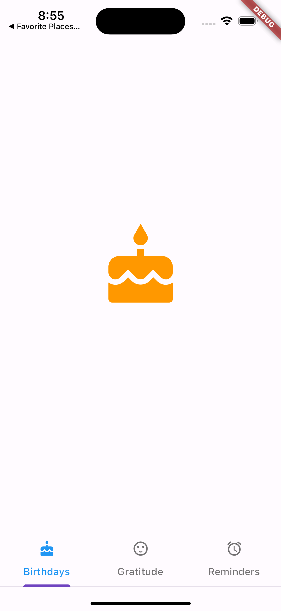
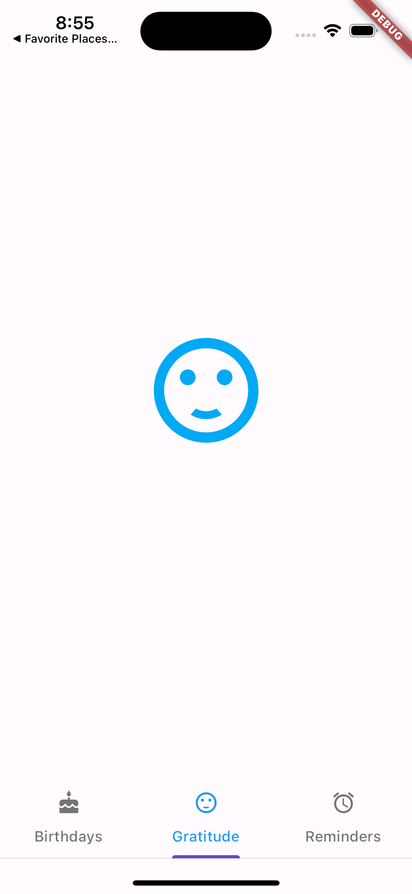
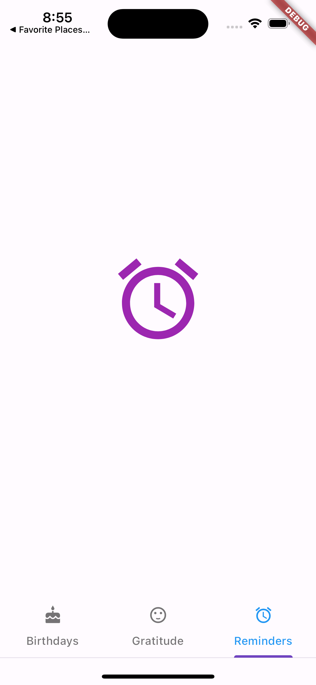

# tabbar_menu

## Tabbar View Widget 
The TabbarView widget is a Material Design widget that displays a horizontal row of tabs. 

The tabs property takes a list of Widgets, and you add tabs by using the Tab Widget.

## Birthday Tabbar

 

## Gratitude Tabbar

 

## Reminder Tabbar

 
